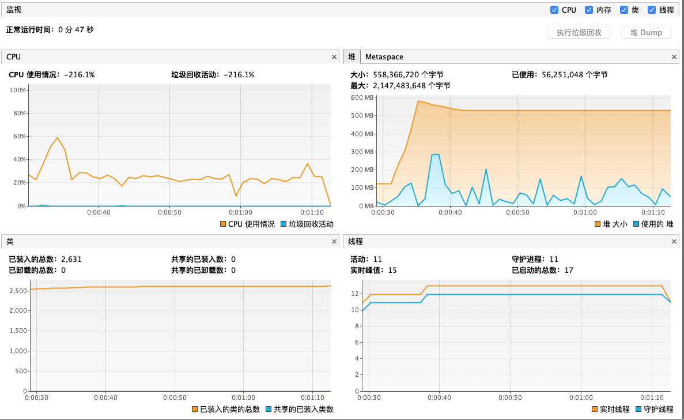

优化前性能测试


```
# Warmup Iteration   2: 69080.399 ops/s
# Warmup Iteration   3: 63171.699 ops/s
Iteration   1: 48573.886 ops/s
Iteration   2: 59961.024 ops/s
Iteration   3: 66778.868 ops/s


Result "com.bofa.protocol.scjy.ScjyProtocol.test_07Meter":
  58437.926 ±(99.9%) 167797.833 ops/s [Average]
  (min, avg, max) = (48573.886, 58437.926, 66778.868), stdev = 9197.565
  CI (99.9%): [≈ 0, 226235.759] (assumes normal distribution)


# Run complete. Total time: 00:00:47

REMEMBER: The numbers below are just data. To gain reusable insights, you need to follow up on
why the numbers are the way they are. Use profilers (see -prof, -lprof), design factorial
experiments, perform baseline and negative tests that provide experimental control, make sure
the benchmarking environment is safe on JVM/OS/HW level, ask for reviews from the domain experts.
Do not assume the numbers tell you what you want them to tell.

Benchmark                   Mode  Cnt      Score        Error  Units
ScjyProtocol.test_07Meter  thrpt    3  58437.926 ± 167797.833  ops/s
```




优化后性能测试

1.  移除不再使用netty提供的ByteBufUtil类提供的hexDump api, 里面大量的创建char[]和String对象, 转用字符缓冲区处理.
2.  缓冲池初始容量不再走默认, 根据每次传进的字节数 << 1, 减少PoolSubPage的缓冲分页开销
3.  这里没优化解析对象后显式释放channel中spel的context, 是因为考虑对QPS的取舍, 在高并发高吞吐的场景, 尽可能保证流量吞吐权衡, 可基于过期时间自动回收spel的context.


```html
# Warmup Iteration   2: 64487.299 ops/s
# Warmup Iteration   3: 61511.133 ops/s
Iteration   1: 67704.731 ops/s
Iteration   2: 68056.235 ops/s
Iteration   3: 79336.375 ops/s


Result "com.bofa.protocol.scjy.ScjyProtocol.test_07Meter":
  71699.113 ±(99.9%) 120707.716 ops/s [Average]
  (min, avg, max) = (67704.731, 71699.113, 79336.375), stdev = 6616.397
  CI (99.9%): [≈ 0, 192406.829] (assumes normal distribution)


# Run complete. Total time: 00:00:47

REMEMBER: The numbers below are just data. To gain reusable insights, you need to follow up on
why the numbers are the way they are. Use profilers (see -prof, -lprof), design factorial
experiments, perform baseline and negative tests that provide experimental control, make sure
the benchmarking environment is safe on JVM/OS/HW level, ask for reviews from the domain experts.
Do not assume the numbers tell you what you want them to tell.

Benchmark                   Mode  Cnt      Score        Error  Units
ScjyProtocol.test_07Meter  thrpt    3    71699.113 ± 120707.716  ops/s
```


